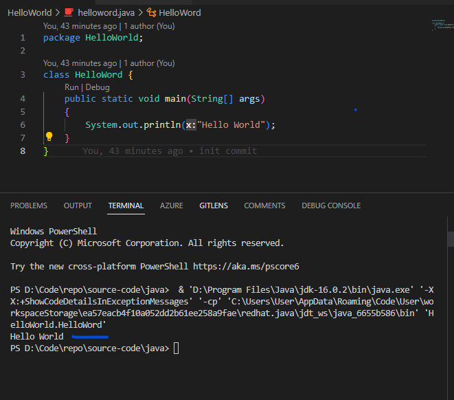

# Tutorial One

## Set Up For Tut1 - Hello, World!
A java file should have `.java` extension.
To run these kinds of file we need a the [JDK](https://www.oracle.com/za/java/technologies/downloads/) for c and an editor/IDE like [vs code](https://code.visualstudio.com/)  

I like using vs code for my development, so you can check out this [url](https://code.visualstudio.com/docs/java/java-tutorial) on how to get stuff set up for java.

## The helloword.java file:
The file in the Helloword directory is a java file that prints out **Hello World** to the user console: 

Don't be alarmed by the terminal text just concentrate on the blue mark on the screen.

## How does it all work.
